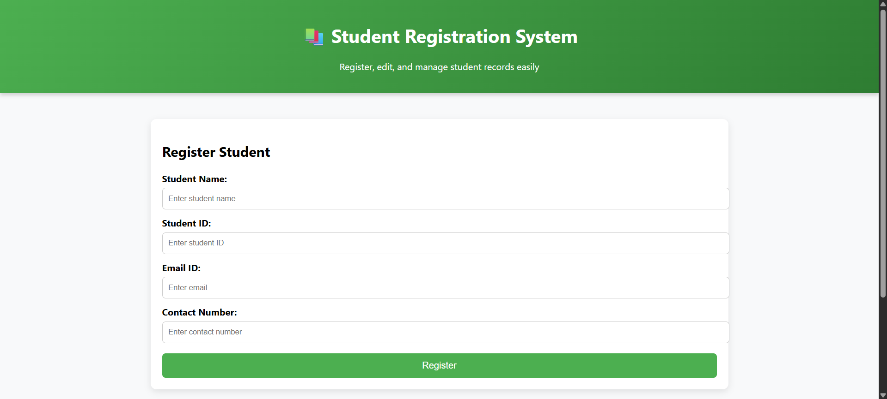

# Student Registration System

## 📌 Description
A simple, responsive student registration system with add, edit, delete, and local storage features.

## 🚀 Features
- Add new students
- Edit and delete records
- Data persistence using localStorage
- Form validation for name, ID, email, and contact
- Responsive design for mobile, tablet, and desktop

## 📂 File Structure
index.html
style.css
script.js
README.md

## 💻 How to Run
1. Clone the repository
2. Open `index.html` in a browser

## 📷 Screenshots

## 🛠 Technologies Used
- HTML
- CSS
- JavaScript

## Github Repo Link
https://github.com/AdityaGaikar91/Student_Registration_System

## 👨‍💻 Author
Aditya Gaikar
